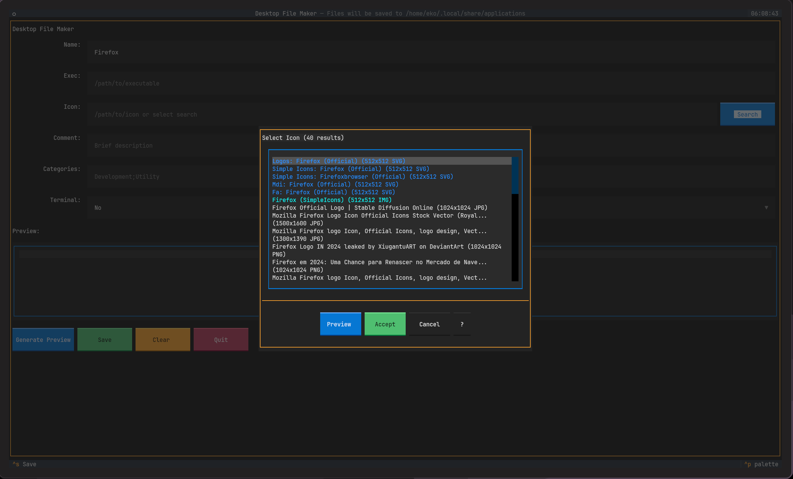
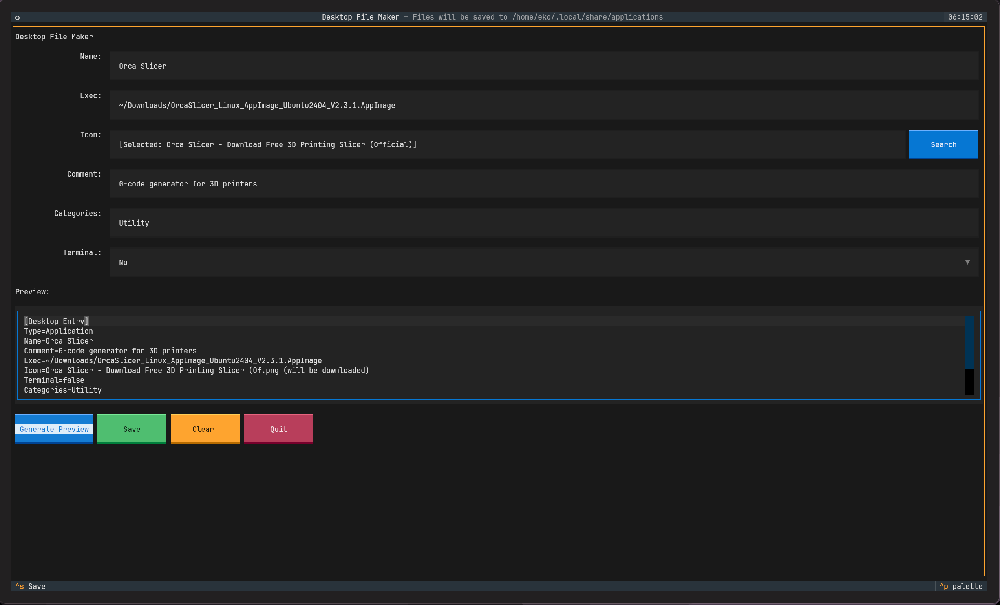

# Desktop File Maker

[](https://github.com/NerfEko/DesktopFileMaker/releases/latest)
[](LICENSE)
[](https://www.python.org/downloads/)

<div align="center">
  
  <br><br>
  
</div>

A Linux TUI application for creating `.desktop` files. Runs in your terminal with a text-based interface.

**Note**: This is a terminal application - run it from a command line.

## Features

- Interactive terminal interface
- Icon search from multiple sources
- Autocomplete for executables and paths
- AppImage support with auto-detection
- Field validation
- Live preview of desktop files
- Saves to correct locations (user or system)
- Works on all Linux distributions

## Installation

### Option 1: AppImage (Recommended)

1. Download from the [Releases page](https://github.com/NerfEko/DesktopFileMaker/releases/latest)
2. Make it executable and run:
   ```bash
   chmod +x DesktopFileMaker-0.1.0-x86_64.AppImage
   ./DesktopFileMaker-0.1.0-x86_64.AppImage
   ```

### Option 2: Install from Source

```bash
git clone https://github.com/NerfEko/DesktopFileMaker.git
cd DesktopFileMaker
./install.sh
```

Choose user installation (default) or system-wide (requires sudo).

### Option 3: Using Make

```bash
git clone https://github.com/NerfEko/DesktopFileMaker.git
cd DesktopFileMaker
make install
```

### Option 4: Manual Installation

```bash
git clone https://github.com/NerfEko/DesktopFileMaker.git
cd DesktopFileMaker

# Create virtual environment
python3 -m venv venv

# Activate it
source venv/bin/activate

# Install
pip install -e .
```

### Option 5: Using pipx (Isolated Installation)

```bash
pipx install git+https://github.com/NerfEko/DesktopFileMaker.git
```

The installer uses a virtual environment to avoid conflicts with system Python packages.

---

## Building AppImage Locally

Want to build the AppImage yourself?

```bash
# Clone the repository
git clone https://github.com/NerfEko/DesktopFileMaker.git
cd DesktopFileMaker

# Build AppImage
./build-appimage.sh

# Find the AppImage in dist/
./dist/DesktopFileMaker-*.AppImage
```

The build script will:
- Download appimagetool automatically
- Create a bundled Python environment
- Package everything into a single executable
- Output to `dist/` directory

## Quick Start

## Usage

### Running the Application

```bash
# AppImage
./DesktopFileMaker-0.1.0-x86_64.AppImage

# Installed version
desktop-file-maker

# Or from source
make run
```

### Terminal Requirements

- Any modern terminal emulator (GNOME Terminal, Konsole, xterm, etc.)
- Terminal with color support (most modern terminals)
- Minimum 80x24 character terminal size (larger recommended)

### Basic Usage

1. Fill in the required fields:
   - **Name**: Application name
   - **Exec**: Path to executable
   - **Icon**: Icon name or path (optional)
   - **Comment**: Description (optional)
2. Press Ctrl+S to save
3. Press Ctrl+C to quit

Use Tab/Shift+Tab to navigate between fields.

## Usage Examples

### Creating a Desktop File for an AppImage

```
Name: My Cool App
Exec: /home/user/Downloads/MyCoolApp-1.0.AppImage
Icon: application-x-appimage
Comment: An awesome application
Categories: Development;Utility
Terminal: No
```

### Creating a Desktop File for a Python Script

```
Name: Python Tool
Exec: /usr/bin/python3 /home/user/scripts/tool.py
Icon: application-x-python
Comment: A useful Python tool
Categories: Development;Utility
Terminal: Yes
```

## Desktop File Format

The application generates standard `.desktop` files following the [freedesktop.org Desktop Entry Specification](https://specifications.freedesktop.org/desktop-entry-spec/latest/).

Example generated file:

```ini
[Desktop Entry]
Type=Application
Name=My App
Comment=A cool application
Exec=/home/user/app.AppImage
Icon=app-icon
Categories=Development;Utility
Terminal=false
StartupNotify=true
```

## Project Structure

```
desktop-file-maker/
├── src/
│   ├── core/                    # Core business logic (optimized)
│   │   ├── desktop_file.py      # Desktop file generation/parsing
│   │   ├── validation.py        # Field validation
│   │   ├── file_system.py       # File operations
│   │   ├── icon_handler.py      # Icon management (cleaned up)
│   │   └── icon_search.py       # Icon search (with graceful degradation)
│   ├── tui/                     # Terminal UI
│   │   ├── app.py               # Main application (optimized imports)
│   │   └── widgets/             # Custom widgets (cleaned up)
│   │       ├── exec_suggester.py
│   │       ├── icon_path_suggester.py
│   │       └── icon_selector.py
│   └── main.py                  # Entry point
├── tests/                       # Test suite
│   ├── test_desktop_file.py
│   ├── test_validation.py
│   ├── test_file_system.py
│   └── test_icon_search.py
├── appimage/                    # AppImage build resources
│   ├── generate_icon.py
│   └── desktop-file-maker.desktop
├── build-appimage.sh            # AppImage build script
├── pyproject.toml              # Modern Python packaging
├── requirements.txt
└── README.md
```

### Recent Optimizations (v0.1.0)

- 🗑️ **Removed 130+ lines** of unused `get_common_icon_names()` function
- 🧹 **Cleaned up imports** - removed unused `Static` widgets
- 📦 **Modernized packaging** - removed legacy `setup.py`, using `pyproject.toml`
- 🔧 **Optional dependencies** - icon search gracefully degrades if `ddgs` not available
- 📁 **Removed empty directories** - cleaned up unused `screens/` folder

## What's New in v0.1.0

This release focuses on **code quality and optimization**:

### ✨ Major Cleanup
- **163 net lines removed** from codebase while maintaining full functionality
- Eliminated redundant code and unused functions
- Streamlined imports and dependencies

### 📦 Better Packaging
- Modern `pyproject.toml` configuration
- Simplified dependency management
- Consistent requirements across all config files

### 🛡️ Improved Reliability  
- Made optional dependencies truly optional
- Better error handling for missing components
- Graceful degradation of features

### 🚀 AppImage Ready
- Fresh AppImage build (50MB, x86_64)
- Fully self-contained with embedded Python
- Works on any Linux distribution without installation

## Architecture

### Core Modules (Pure Functions)

The core logic is built with pure functions following functional programming principles:

- **desktop_file.py**: Generate and parse `.desktop` file content
- **validation.py**: Validate all input fields
- **file_system.py**: Handle file operations and placement
- **icon_handler.py**: Manage icon selection and copying

### TUI Layer

Built with [Textual](https://textual.textualize.io/), a modern Python TUI framework:

- Responsive, keyboard-driven interface
- Real-time validation feedback
- Live preview of generated files
- Intuitive form layout

## Testing

Run the test suite:

```bash
# Using make
make test

# With coverage
make test-cov

# Or manually
source venv/bin/activate
pytest

# With coverage
pytest --cov=src tests/
```

## Keyboard Shortcuts

| Shortcut | Action |
|----------|--------|
| `Tab` | Move to next field |
| `Shift+Tab` | Move to previous field |
| `Enter` | Activate button/field (context-dependent) |
| `Space` | Toggle selection in select fields |
| `Arrow Keys` | Navigate within multi-option fields |
| `Ctrl+S` | Save desktop file |
| `Ctrl+C` | Quit application |
| `Escape` | Cancel current operation/close modal |

### Field-Specific Controls

- **Text Input Fields**: Type normally, use Ctrl+A to select all
- **Select Fields**: Use arrow keys or mouse to choose options
- **Autocomplete**: Start typing, suggestions appear automatically
- **Icon Search**: Click "Search" button or press Enter in icon field

## Uninstallation

```bash
./uninstall.sh
```

Or manually:
```bash
rm -rf venv
rm ~/.local/bin/desktop-file-maker
rm ~/.local/share/applications/desktop-file-maker.desktop
```

## Common Use Cases

### 1. Create Desktop Entry for AppImage

```bash
# Launch the app
desktop-file-maker

# Fill in:
# Name: MyApp
# Exec: /home/user/Downloads/MyApp.AppImage
# Icon: myapp
# Categories: Development
# Save!
```

### 2. Create Desktop Entry for Shell Script

```bash
# Name: My Script
# Exec: /usr/local/bin/myscript.sh
# Terminal: Yes
# Categories: Utility
```

### 3. Create Desktop Entry for Python Application

```bash
# Name: Python App
# Exec: /usr/bin/python3 /opt/myapp/main.py
# Icon: application-x-python
# Categories: Development;Utility
```

## Troubleshooting

### AppImage Issues

**Permission denied:**
```bash
chmod +x DesktopFileMaker-*.AppImage
```

**Nothing happens when double-clicking:**
Run it from a terminal instead.

**AppImage won't execute:**
- Ensure 64-bit Linux system
- Install FUSE if needed: `sudo apt install fuse`

### Interface Issues

**Interface looks broken:**
- Use a modern terminal with color support
- Ensure terminal is at least 80x24 characters

**Can't navigate:**
- Use Tab/Shift+Tab to move between fields
- Use arrow keys in selection fields

**Icon search not working:**
Icon search requires internet connection. The app works fine without it.

### Desktop File Issues

### Desktop file not appearing in application menu

1. Ensure the file is saved to `~/.local/share/applications/`
2. Run `update-desktop-database ~/.local/share/applications/`
3. Restart your desktop environment or application menu

### Icon not showing

1. Verify the icon name exists in your system icon theme
2. Use `find /usr/share/icons -name "icon-name*"` to search
3. Or provide the full path to an icon file

### Permission denied when saving

1. Check that `~/.local/share/applications/` exists and is writable
2. Create it if needed: `mkdir -p ~/.local/share/applications/`
3. For system-wide installation, use `sudo` (not recommended)

## Contributing

Contributions are welcome! Please:

1. Fork the repository
2. Create a feature branch
3. Write tests for new functionality
4. Submit a pull request

## Code Standards

This project follows functional programming principles with pure functions, immutable data, and comprehensive tests.

## License

MIT License - see LICENSE file for details

## Resources

- [freedesktop.org Desktop Entry Spec](https://specifications.freedesktop.org/desktop-entry-spec/latest/)
- [Textual Documentation](https://textual.textualize.io/)
- [XDG Base Directory Specification](https://specifications.freedesktop.org/basedir-spec/basedir-spec-latest.html)

## Support

For issues, questions, or suggestions, please open an issue on GitHub.


